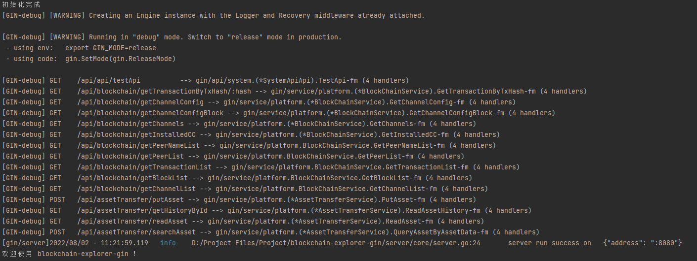
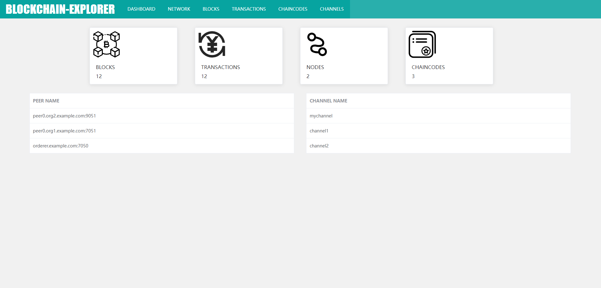
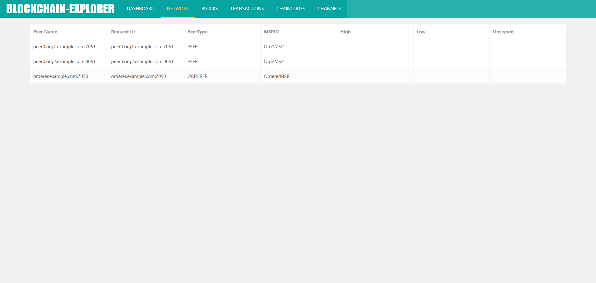
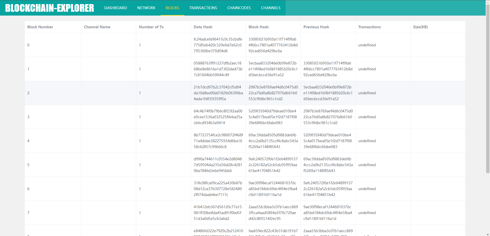
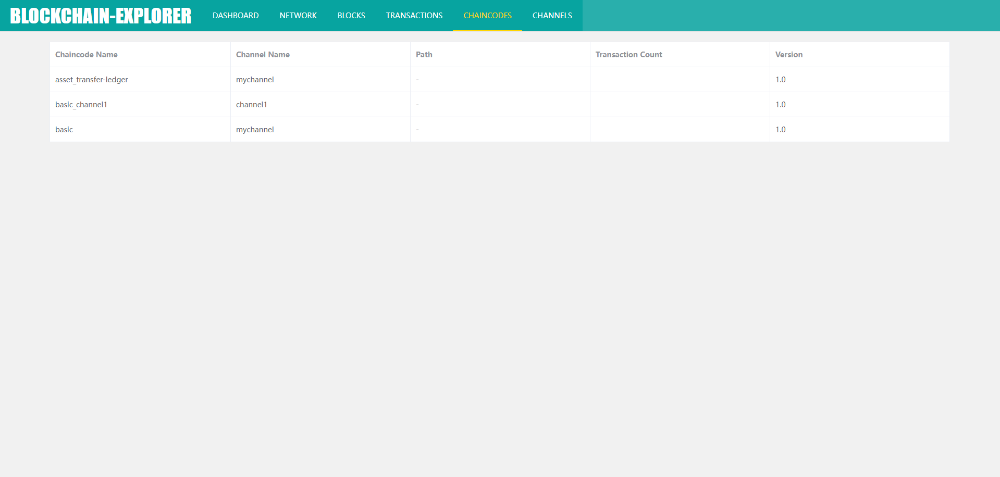
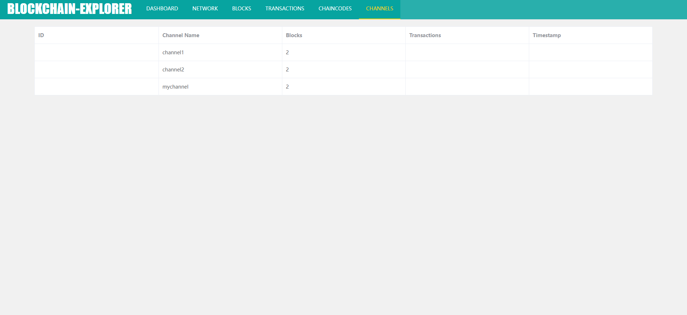

# Blockchain-Explorer-Gin

The project is a blockchain browser based on fabric. The back-end uses gin as the web framework and uses fabric SDK go for development. The front end is built with Vue framework.

## Start
By default, you have set up the fabric network, and you need to set up at least one peer node along with one organization.

If you've already done this, then start blockchain-explorer-gin

### start the back end
```bash
cd server

go mod tidy
go run main.go
```


### start the font end
```bash
cd client

npm install
npm run serve
```

## Page display
**Dashboard**



**Network**



**Block**



**Transaction**


**Chaincode**



**Channel**



